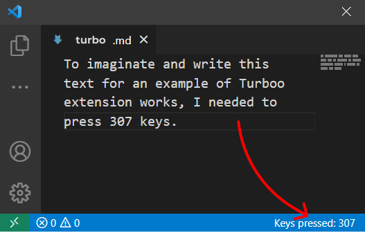

# Turboo README

**Turbo** is an extension for **VS Code** to count all keys pressed.

My first experience with the **TS language**

[Extension store](https://marketplace.visualstudio.com/items?itemName=NGS.turboo)
